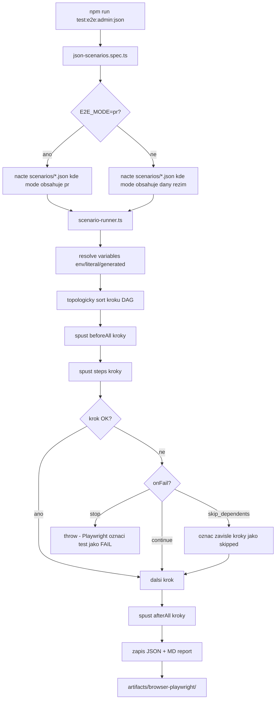

# E2E JSON Scenarios — Runner Guide

Tento guide vysvetluje, jak spoustet JSON-rizene E2E testy pro CMS admin panel (Playwright).
JSON scenare jsou v `tests/e2e/scenarios/`, spousteci spec je `tests/e2e/json-scenarios.spec.ts`.

## 1. Predpoklady

Pred prvnim spustenim over:

```bash
# Node dependencies musi byt nainstalovane
npm ci

# Playwright browsery musi byt stahnute
npx playwright install chromium
```

Lokalni server musi bezet (nebo nastavit `PLAYWRIGHT_CMS_BASE_URL`, viz sekce 3):

```bash
php artisan serve
```

Seeder musi mit admin uzivatele:

```bash
php artisan db:seed --class=AdminUserSeeder
```

## 2. Spusteni — zakladni prikazy

### C1 — PR gate (rezim `pr`, vychozi)

```bash
npm run test:e2e:admin:json
```

Spusti vsechny scenare s `"mode": ["pr", ...]`.

### C2 — Nightly smoke (rezim `nightly`)

```bash
npm run test:e2e:admin:json:nightly
```

Spusti vsechny scenare s `"mode": ["nightly", ...]`.

### Jeden konkretni scenar (ad-hoc)

```bash
npx playwright test --config=playwright.admin.config.ts tests/e2e/json-scenarios.spec.ts \
  --grep "admin.pages.create-delete"
```

### Ladeni s viditelnym prohlizecem

```bash
npx playwright test --config=playwright.admin.config.ts tests/e2e/json-scenarios.spec.ts \
  --headed --grep "admin.pages.create-delete"
```

## 3. Env promenne

| Promenna | Vychozi hodnota | Popis |
|----------|-----------------|-------|
| `E2E_MODE` | `pr` | Filtr scenaru: `pr`, `nightly`, `release`, `ad-hoc` |
| `E2E_ADMIN_EMAIL` | `admin@example.com` | Prihlasovaci email admina |
| `E2E_ADMIN_PASSWORD` | `password` | Heslo admina |
| `PLAYWRIGHT_CMS_BASE_URL` | _(auto-start serveru)_ | URL behicho serveru; kdyz je nastavena, Playwright server nespousti |
| `PLAYWRIGHT_CMS_HOST` | `127.0.0.1` | Host pro auto-start serveru |
| `PLAYWRIGHT_CMS_PORT` | `8000` | Port pro auto-start serveru |

Priklad spusteni s vlastnim URL:

```bash
PLAYWRIGHT_CMS_BASE_URL=https://ercee-cms.test npm run test:e2e:admin:json
```

## 4. Kde najdes vysledky

### Konzole

Playwright vypise prehled behu primo do terminalu:

```
✓  [json] admin.pages.create-delete (4.2s)
✗  [json] admin.subscribers.crud (2.1s)
```

### Artefakty v `artifacts/browser-playwright/`

Po kazdem behu se tam objevi:

| Soubor | Obsah |
|--------|-------|
| `browser-deterministic.json` | Strojovy souhrn celeho behu (status, pocty, trvani) |
| `browser-deterministic.md` | Citelny souhrn behu s tabulkou scenaru |
| `<scenarioId>.<timestamp>.json` | Detail jednoho scenare (kazdy krok, duration, error) |
| `<scenarioId>.<timestamp>.md` | Human-readable detail jednoho scenare |

Playwright trace soubory (pro failnute kroky) jsou ve `test-results/` — viz sekce 5.

## 5. Jak debugovat failnuty krok

Kdyz test failne, Playwright automaticky ulozi trace (nastaveno v `playwright.admin.config.ts`).

### Zobrazeni trace v UI

```bash
npx playwright show-trace test-results/<scenar>/trace.zip
```

Trace viewer uka:
- krok po kroku co se stalo,
- screenshot pred a po kazde akci,
- konzolove logy a sitove requesty.

### Cteni JSON reportu

V `artifacts/browser-playwright/<scenarioId>.<timestamp>.json` najdes:

```json
{
  "steps": [
    {
      "stepId": "fill-page-title",
      "status": "failed",
      "duration": 234,
      "retries": 1,
      "error": "Timeout 30000ms exceeded waiting for locator..."
    }
  ]
}
```

Chyba v poli `error` ti rika co presne selhalo a na jakem selektoru.

### Spusteni s pomalym pohybem (slow motion)

```bash
PLAYWRIGHT_SLOW_MO=500 npx playwright test --config=playwright.admin.config.ts \
  tests/e2e/json-scenarios.spec.ts --headed --grep "admin.pages.create-delete"
```

## 6. Jak funguje JSON scenar (stuctura)

Kazdy `.json` soubor v `tests/e2e/scenarios/` je jeden scenar. Priklad:

```json
{
  "scenarioId": "admin.pages.create-delete",
  "version": 2,
  "mode": ["pr", "nightly"],
  "variables": {
    "pageTitle": { "source": "generated", "type": "random_string", "length": 8 }
  },
  "beforeAll": [
    { "id": "login", "action": "loginAdmin" }
  ],
  "steps": [
    { "id": "open-list", "action": "openResource", "resource": "pages" },
    { "id": "fill-title", "action": "fill",
      "selector": { "type": "css", "value": "input[id='data.title']" },
      "value": "Test {{pageTitle}}",
      "dependsOn": ["open-list"] }
  ]
}
```

Klicove pojmy:
- `mode` — v jakem rezimu se scenar spousti (`pr`, `nightly`, `release`, `ad-hoc`)
- `variables` — promenne s hodnotami z env, literalu nebo generovanymi
- `beforeAll` — kroky pred testem (typicky login)
- `steps` — hlavni kroky; `dependsOn` rika co musi probehnut drive
- `action` — typ akce (`goto`, `fill`, `click`, `loginAdmin`, `openResource`, ...)

Referencni priklad: `tests/e2e/scenarios/examples/admin.login.json`

Schema pro validaci (IDE autocomplete): `tests/e2e/schema/e2e-scenario.schema.v2.json`

## 7. Adresarova struktura

```
tests/e2e/
├── schema/
│   └── e2e-scenario.schema.v2.json   ← JSON Schema (IDE hint + validace)
├── scenarios/
│   ├── examples/                     ← Referencni priklady, NESPOUSTEJI SE automaticky
│   │   └── admin.login.json
│   └── admin.pages.create-delete.json  ← Aktivni scenar (spousti se)
├── runner/
│   ├── types.ts                      ← TypeScript typy
│   ├── executors.ts                  ← Playwright akce
│   ├── reporter.ts                   ← Zapis reportu
│   └── scenario-runner.ts           ← Hlavni runner (DAG, retry, onFail)
├── json-scenarios.spec.ts            ← Playwright spec (vstupni bod)
└── admin-login.spec.ts               ← Stavajici smoke test (beha zvlast)
```

## 8. Nejbeznejsi chyby

| Chyba | Pricina | Reseni |
|-------|---------|--------|
| `Error: connect ECONNREFUSED` | Server nebezi | Spust `php artisan serve` nebo nastav `PLAYWRIGHT_CMS_BASE_URL` |
| `Timeout ... exceeded` | Selektor nefunguje nebo stranka se nenacetla | Over selector v trace vieweru; mozna chybi `data-testid` |
| `No scenarios found for mode="pr"` | Zadny JSON soubor nema `"mode": ["pr"]` | Over ze je scenar v `tests/e2e/scenarios/` (ne v `examples/`) |
| `Expected version 2` | JSON soubor ma spatnou verzi | Pridej `"version": 2` do scenare |
| `Circular dependency detected` | `dependsOn` tvori smycku | Over cyklicke zavislosti mezi kroky |
| Admin login failne | Chybi seeded user | Spust `php artisan db:seed --class=AdminUserSeeder` |

## 9. Diagram toku



## Related docs

- `docs/guides/spusteni-testu-junior.md` — spousteni PHP unit/feature testu
- `docs/guides/testing-flow-junior.md` — celkovy testing flow pro zmeny
- `tests/e2e/schema/e2e-scenario.schema.v2.json` — schema pro psani scenaru
- `tests/e2e/scenarios/examples/admin.login.json` — referencni priklad scenare
