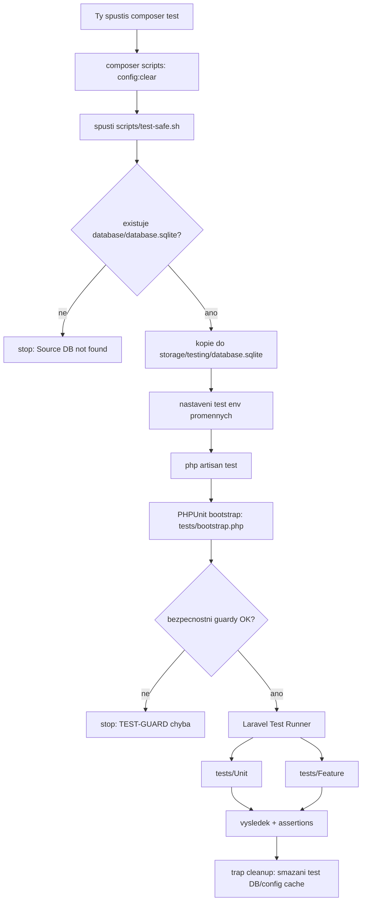

# Spusteni testu v Ercee-cms (junior guide)

Tento guide vysvetluje:
- jak testy v `/usr/local/var/www/Ercee-cms/tests` fungují,
- jak je spustit bez rizika pro lokalni DB,
- co ma byt v testu a co tam naopak nepatri.

## 1. Jak testy spustit

Zakladni spusteni cele sady:

```bash
cd /usr/local/var/www/Ercee-cms
composer test
```

Tohle interne udela:
1. `php artisan config:clear --ansi`
2. `./scripts/test-safe.sh`

Spusteni jedne test class:

```bash
cd /usr/local/var/www/Ercee-cms
./scripts/test-safe.sh tests/Feature/CheckoutFlowTest.php
```

Spusteni jednoho konkretniho testu:

```bash
cd /usr/local/var/www/Ercee-cms
./scripts/test-safe.sh tests/Feature/FormSubmissionTest.php --filter=test_can_submit_form_successfully
```

## 2. Co musi byt nastavene pred spustenim

Minimalni predpoklady:
- nainstalovane dependencies (`composer install`),
- existuje soubor `database/database.sqlite` (test-safe script z nej dela kopii),
- testy se musi spoustet v `APP_ENV=testing`.

Kdyz setup jeste nebezel:

```bash
cd /usr/local/var/www/Ercee-cms
composer setup
```

## 3. Proc se pouziva `scripts/test-safe.sh`

`scripts/test-safe.sh` chrani lokalni data:
1. Zkopiruje `database/database.sqlite` do `storage/testing/database.sqlite`.
2. Nastavi env pro beh testu:
   - `DB_CONNECTION=sqlite`
   - `DB_DATABASE=storage/testing/database.sqlite`
   - `APP_CONFIG_CACHE=storage/testing/config.php`
   - `ERCEE_TEST_SAFE=1`
3. Spusti `php artisan test`.
4. Po dobehu kopii DB i config cache smaze (cleanup).

## 4. Mermaid diagram celeho toku



## 5. Co je v testu (a proc)

Typicka Feature test class ma:
- `extends Tests\TestCase`,
- casto `use RefreshDatabase;` (kazdy test bezi na ciste DB vrstve),
- Arrange -> Act -> Assert.

Priklady z aktualnich testu:
- `tests/Feature/CheckoutFlowTest.php`: mock payment gateway + DB assertion na `orders` a `subscribers`.
- `tests/Feature/FormSubmissionTest.php`: happy path + validace + honeypot branch + event assertion.
- `tests/Feature/CookieConfigEndpointTest.php`: default config, ukladani, cache chovani, mapovani page URL.
- `tests/Feature/Modules/ModuleRegistrationTest.php`: registrace modulu, singleton manager, config merge.
- `tests/Feature/Modules/LlmCore/LlmIntegrationTest.php`: fake provider + kontrola domain eventu.

## 6. Co v testu nema byt

Do testu nepatri:
- zavislost na realnych externich sluzbach (platebni brana, LLM API, email provider),
- nahodne/flaky asserty bez stabilniho vysledku,
- pouze `assertJsonStructure` bez business overeni,
- testy zavisle na "nahodnem" stavu lokalni DB mimo fixture/factory.

Spravne:
- externi veci mockovat/fakeovat,
- overovat business pravidla (status, DB side effect, event),
- mit i negativni scenare (404/422/401/403 podle endpointu).

## 7. Rychla orientace ve slozce `tests/`

- `tests/bootstrap.php`: bezpecnostni guardy (test env, sqlite only, safe config cache).
- `tests/TestCase.php`: sdilena base trida; pridava default auth header.
- `tests/Unit/*`: cista logika, bez HTTP vrstvy.
- `tests/Feature/*`: endpointy, validace, side effects, integrace modulu.

## 8. Nejbeznejsi chyby pri spusteni

- `Source DB not found`: chybi `database/database.sqlite`.
- `[TEST-GUARD] Refusing to run tests outside APP_ENV=testing.`: spatne env.
- `[TEST-GUARD] File-based test DB requires scripts/test-safe.sh`: test byl spusten mimo `test-safe.sh`.

Kdyz si nejsi jisty, vzdy pouzij:

```bash
cd /usr/local/var/www/Ercee-cms
./scripts/test-safe.sh
```
