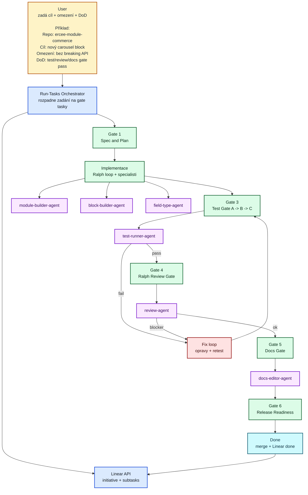
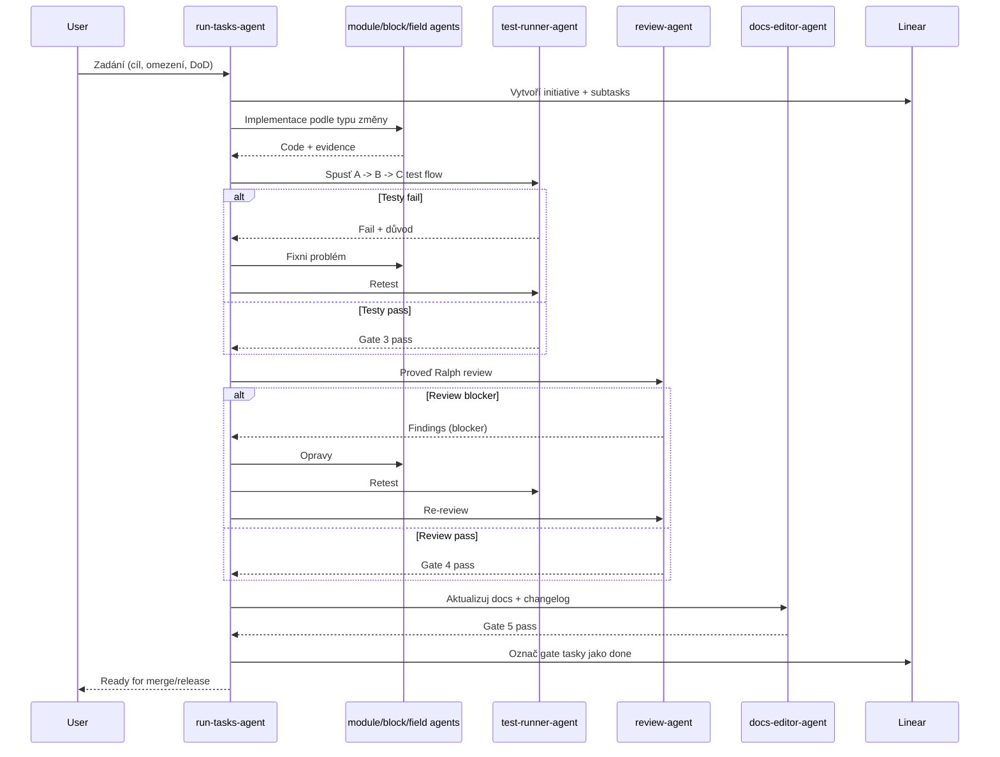

# Junior Agent Flow Diagram

## 1) Přehled celého flow

```mermaid
flowchart TD
    %% Nodes
    U[User<br/>zadá cíl + omezení + DoD<br/><br/>Příklad:<br/>Repo: ercee-module-commerce<br/>Cíl: nový carousel block<br/>Omezení: bez breaking API<br/>DoD: test/review/docs gate pass]
    O[Run-Tasks Orchestrator<br/>rozpadne zadání na gate tasky]
    L[Linear API<br/>initiative + subtasks]

    G1[Gate 1<br/>Spec and Plan]
    I[Implementace<br/>Ralph loop + specialisti]
    G3[Gate 3<br/>Test Gate A -> B -> C]
    G4[Gate 4<br/>Ralph Review Gate]
    G5[Gate 5<br/>Docs Gate]
    G6[Gate 6<br/>Release Readiness]

    M[module-builder-agent]
    B[block-builder-agent]
    F[field-type-agent]
    T[test-runner-agent]
    R[review-agent]
    D[docs-editor-agent]

    FIX[Fix loop<br/>opravy + retest]
    DONE[Done<br/>merge + Linear done]

    %% Flow
    U --> O
    O --> L
    O --> G1
    G1 --> I

    I --> M
    I --> B
    I --> F

    I --> G3
    G3 --> T
    T -->|pass| G4
    T -->|fail| FIX
    FIX --> G3

    G4 --> R
    R -->|blocker| FIX
    R -->|ok| G5

    G5 --> D
    D --> G6
    G6 --> DONE
    DONE --> L

    %% Styling
    classDef user fill:#fef3c7,stroke:#b45309,stroke-width:2px,color:#1f2937;
    classDef orchestrator fill:#dbeafe,stroke:#1d4ed8,stroke-width:2px,color:#111827;
    classDef gate fill:#dcfce7,stroke:#166534,stroke-width:2px,color:#052e16;
    classDef agent fill:#fae8ff,stroke:#7e22ce,stroke-width:2px,color:#3b0764;
    classDef loop fill:#fee2e2,stroke:#991b1b,stroke-width:2px,color:#450a0a;
    classDef done fill:#cffafe,stroke:#155e75,stroke-width:2px,color:#083344;

    class U user;
    class O,L orchestrator;
    class G1,I,G3,G4,G5,G6 gate;
    class M,B,F,T,R,D agent;
    class FIX loop;
    class DONE done;
```

## 2) Co přesně dělá user vs. agent

```mermaid
sequenceDiagram
    participant User
    participant Orchestrator as run-tasks-agent
    participant Specialists as module/block/field agents
    participant Tester as test-runner-agent
    participant Reviewer as review-agent
    participant Docs as docs-editor-agent
    participant Linear

    User->>Orchestrator: Zadání (cíl, omezení, DoD)
    Orchestrator->>Linear: Vytvoří initiative + subtasks
    Orchestrator->>Specialists: Implementace podle typu změny
    Specialists-->>Orchestrator: Code + evidence

    Orchestrator->>Tester: Spusť A -> B -> C test flow
    alt Testy fail
        Tester-->>Orchestrator: Fail + důvod
        Orchestrator->>Specialists: Fixni problém
        Orchestrator->>Tester: Retest
    else Testy pass
        Tester-->>Orchestrator: Gate 3 pass
    end

    Orchestrator->>Reviewer: Proveď Ralph review
    alt Review blocker
        Reviewer-->>Orchestrator: Findings (blocker)
        Orchestrator->>Specialists: Opravy
        Orchestrator->>Tester: Retest
        Orchestrator->>Reviewer: Re-review
    else Review pass
        Reviewer-->>Orchestrator: Gate 4 pass
    end

    Orchestrator->>Docs: Aktualizuj docs + changelog
    Docs-->>Orchestrator: Gate 5 pass
    Orchestrator->>Linear: Označ gate tasky jako done
    Orchestrator-->>User: Ready for merge/release
```
